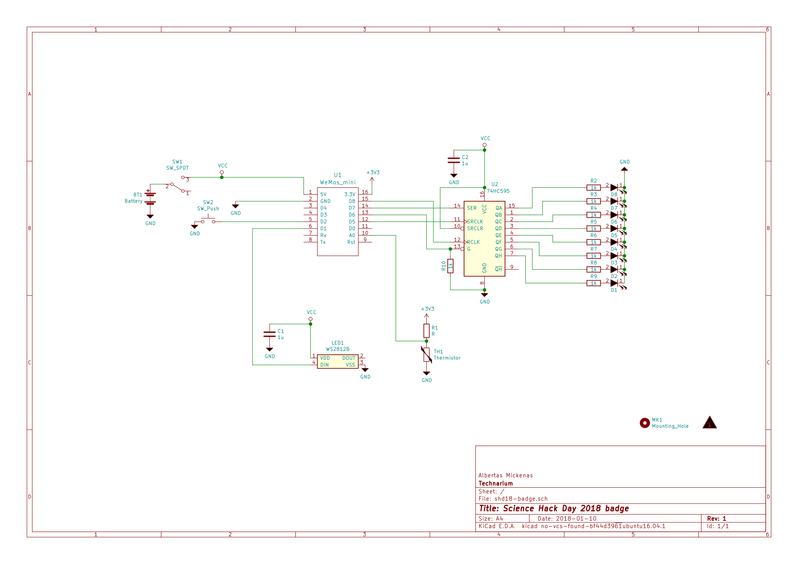

# Science Hack Day Vilnius 2018 - badge

Participant badge for Science Hack Day Vilnius 2018

## Prerequisites

To use the badge, you will need the following:

 * A laptop with Linux, Mac OS or Windows and at least one free USB port.
 * If it’s Windows or Mac OS, make sure to install [drivers](https://wiki.wemos.cc/downloads) for the CH340 UBS2TTL chip.
 * A micro-USB cable with data lines that fits your USB port.
 * You will need a terminal application installed. For Linux and Mac you can use screen, which is installed by default. For Windows we recommend [PuTTy](http://www.chiark.greenend.org.uk/~sgtatham/putty/download.html) or [CoolTerm](http://freeware.the-meiers.org/).
 * Please note that the workshop will be in English.

## Schematics

## Programming

Use dmesg to determine the USB port the badge is connected to, e.g. /dev/ttyUSB0.

Flash the firmware:
cd shd18badge/micropython

Edit the flash_microcontroller.sh file so that it points to the correct USB port. If esptool.py is needed, install it (for example, pip install esptool.py). Then copy the Python files to the microcontroller:

python transfer_files.py -p /dev/ttyUSB5 -b 115200 util.py main.py thermistor.py boot.py
 
## Tutorial
A pretty great [tutorial is available here](http://docs.micropython.org/en/latest/esp8266/esp8266/tutorial/index.html)
